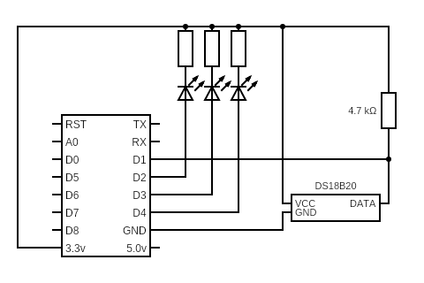

# TempThingy

This device will read temperature from a DS20B18 temperature sensor and report the temperature value through MQTT messages.
The temperature sensor is connected to the Wemos D1 pin. DS20B18 is a OneWire device so a pull-up is required on the data line. Three leds are connected for some simple status indication.



## MQTT messages
The TempThingy will report periodically to a MQTT broker. The payload is a json string containg the temperature value (in celcius) and a configurable ID.

Example:
`{ "id" : "Garage", "temp": 12.5 }`

## Project Setup
- Open the `TempThingy` directory in Plaform IO
- Add the file `credentials.h` to the `src` folder and define WiFi and MQTT creadentials.
  Template:
  ```
  // WIFI
  const char* SSID = "SSID";
  const char* password = "SuperSecretPassword";
  
  // MQTT
  const char* MQTT_broker = "breoker.url";
  const char* MQTT_user = "username";
  const char* MQTT_password = "password";
  ```
- Define the build parameter in `platformio.ini`
- Build and program device
