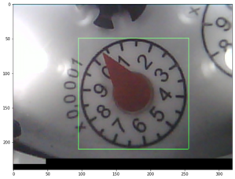
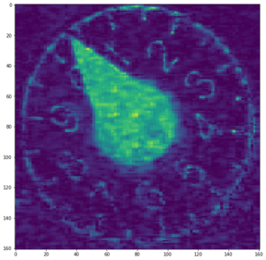

# WaterThingy

This device will observe an analog water meter and report consumption through MQTT messages. A camera module (ESP-32-CAM) is used to observe one of the rotating arrows in the analog water meter. The device will continuously take pictures, do image analysis and report changes as consumption in liters.

The water meter contains 4 gauges with different consumptions per lap where the fastest gauge arrow rotates one lap per 10 liters of water usage. The consumption is calculated from the angular difference between two consecutive images. The camera module is mounted on a 3D-printed camera mount with a standard smart-phone macro lens. Some white leds are connected to provide some light inside the camera mount.

  

## Image analysis
To measure consumption, the angle of a gauge arrow is found by taking an image of the fastest rotating gauge. When the angle has been calculated it is compared with the angle from the previous image result. If the angle has changed, the consumption can be derived from the angular difference.


1. Fetch image from the camera module (jpeg)
2. Convert to RGB-values  
     
   *The green square is the configured bounding box. (The black pixels in the bottom of the image appears to be due to some hardware issue in the ESP-01-CAM module)*
3. Crop image to configured bounding box.  
   
4. Convert to HSL (hue, saturation, lightness ) values. Keeping saturation only.  
   
5. With the saturation only image, a filter is rotated 360&deg; around the center of the image. The filter is rotated 1&deg; per iteration.  
     
   *The line is the filter position where the greatest filter sum was calculated.*


## MQTT messages
The WaterThingy will report periodically (about 2 reports per second) to an MQTT broker. The payload is a json string containing the last measured consumption.

Example:
```
{ 
    "id" : "water_thingy",                      <- device id
    "angle" : 324,                              <- the angle of the gauge arrow
    "diff" : 3,                                 <- difference from last measurement 
    "t_diff" : 561,                             <- time since last measurement
    "consumption" : 0.0079792560,               <- calculated consumption since last measurement
    "acc_consumption" : 9.9687504960            <- accumulated consumption since device start
}
```

## Calibration
The bounding box must be set such that the center of the observed gauge is positioned in the center. The whole gauge should fit inside the bounding box. The filter should be set such that the center circle is ignored while the tip of the gauge arrow is included.

The following parameters can be configured through GET requests:
`capture_x` : The x coordinate for the upper left corner of the bounding box  
`capture_y` : The y coordinate for the upper left corner of the bounding box  
`capture_size` : The size of the bounding box square in pixels  
`filter_start` : The start position of the filter from the center of the image  
`filter_length` : The lengt of the filter  

The parameter value can be set through the route (GET) `/set/{paramter_name}/{value}`


Example:
Set `capture_x = 120` : `GET http://ip_adress/set/capture_x/120`

## Project Setup
- Open root folder in Plaform IO
- Add the file `configuration..h` to the `src` folder and define SSID and password.
  Template:
  ```
  const char* SSID = "MySsid";
  const char* password = "Password";

  const char* mqtt_server = "mqtt.broker.url";
  const char* mqtt_topic = "hallondisp/water";
  const char* mqtt_id = "waterthingy";
  const char* mqtt_user = "username";
  const char* mqtt_pass = "password";
  ```
- Build and program device


