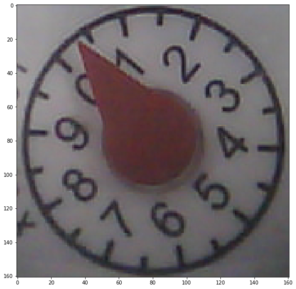

# WaterThingy

This device will observe an analog water meter and report consumption through MQTT messages.

A camera module (ESP-32-CAM) is used to observe the rotating arrow in the analog water meter.
The device will continiously take pictures, do image analysis and report changes as consumption in liters.

The gauge arrow rotates one lap per 10 liters of consumption. The consumption is calculated from the angular difference between two consecutive images. 


## Image analysis
Prepare image for analysis:
1. img_raw = Fetch image from the camera module (jpeg)
2. Convert to RGB-values

*The black (empty) pixels in the bottom of the image appears to be due to some hardware issue in the ESP-01-CAM module.*
3. Crop image to configured bounding box.

4. Convert to HSL (hue, saturation, lightness ) values. Keeping saturation only.


With the saturation only image, a filter is rotated around the center of the image. The filter is rotated 1&deg; per iteration.


*The line is the filter position where the greatest sum was calculated.*

The angle is stored and compared with the previous image result. When the angle is changed, the consumption is calculated.

## MQTT messages
The WaterThingy will report periodically (about 2 reports per second) to an MQTT broker. The payload is a json string containg the last measured consumption.

Example:
```
{ 
    "id" : "water_thingy",                      <- device id
    "angle" : 324,                              <- the angle of the gauge arrow
    "diff" : 3,                                 <- difference from last measurement 
    "t_diff" : 561,                             <- time since last measurement
    "consumption" : 0.0079792560,               <- calculated consumption since last measurement
    "acc_consumption" : 9.9687504960            <- accumilated consumption since device start
}
```

## Configure device
The following parameters can be configured through GET requests:
`capture_x` : The x coordinate for the upper left corner of the bounding box
`capture_y` : The y coordinate for the upper left corner of the bounding box
`capture_size` : The size of the bounding box square in pixels
`filter_start` : The start position of the filter from the center of the image
`filter_length` : The lengt of the filter

To change a configurable paramtere. A GET request is sent to device

Example:
Set `capture_x` to 120: `GET http://ip_adress/set/capture_x/120`

## Project Setup
- Open root folder in Plaform IO
- Add the file `configuration..h` to the `src` folder and define SSID and password.
  Template:
  ```
  const char* SSID = "MySsid";
  const char* password = "Password";

  const char* mqtt_server = "mqtt.broker.url";
  const char* mqtt_topic = "hallondisp/water";
  const char* mqtt_id = "waterthingy";
  const char* mqtt_user = "username";
  const char* mqtt_pass = "password";
  ```
- Build and program device


